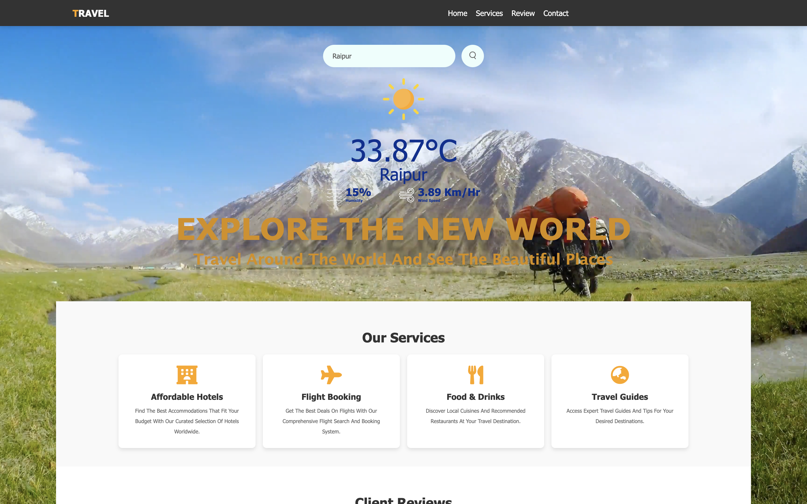

# Travel Itinerary

## Project Overview
Travel Itinerary is a modern web-based application that allows users to search for real-time weather information for any city and helps them plan their travel accordingly. With a sleek and user-friendly interface, it provides essential weather details and saves your search history for future reference.

---

## [Live Demo](https://naseanishka.github.io/travel-itinerary/)

---

## Project Objectives
- Develop a responsive and interactive web application using **Vanilla JavaScript**, **HTML**, and **CSS**.
- Integrate external APIs to fetch dynamic weather data.
- Provide persistent user data storage using Local Storage API.

---

## Technologies Used
- **Frontend:** HTML, CSS, JavaScript (Vanilla)
- **API Integration:** OpenWeather API
- **Local Storage API:** Save and retrieve user search history
- **Additional:**
  - Modern CSS techniques for a responsive and stylish UI
  - Google Fonts for typography
  - Font Awesome for icons

---

## Key Features
1. **Weather Information:**
   - Search for current weather conditions in any city
   - Display key weather metrics such as temperature, humidity, wind speed, and weather descriptions
   - Dynamic background updates based on weather conditions

2. **Travel Planning Support:**
   - Helps users plan trips by providing weather insights
   - Simple and intuitive UI for quick searches

3. **Local Storage Integration:**
   - Saves search history locally on the user's device
   - Allows users to revisit previous searches without an internet connection

4. **Modern User Interface:**
   - Clean and responsive design for mobile, tablet, and desktop devices
   - Interactive components for better user experience

---

## Project Structure
```
Travel-Itinerary/
├── index.html
├── style.css
├── script.js
└── README.md
```

---

## Implementation Details
### Weather API Integration
```javascript
async function fetchWeather(city) {
    const apiKey = 'YOUR_API_KEY'; // Replace with your API key
    const url = `https://api.openweathermap.org/data/2.5/weather?q=${city}&appid=${apiKey}&units=metric`;
    try {
        const response = await fetch(url);
        const data = await response.json();
        if (response.ok) {
            displayWeatherData(data);
        } else {
            alert('City not found. Please try again.');
        }
    } catch (error) {
        console.error('Error fetching weather data:', error);
    }
}
```

### Local Storage Integration
```javascript
function saveSearchHistory(city) {
    let history = JSON.parse(localStorage.getItem('searchHistory')) || [];
    if (!history.includes(city)) {
        history.push(city);
        localStorage.setItem('searchHistory', JSON.stringify(history));
    }
}

function loadSearchHistory() {
    const history = JSON.parse(localStorage.getItem('searchHistory')) || [];
    history.forEach(city => {
        createHistoryItem(city);
    });
}
```

---

## Learning Outcomes
- **API Integration:** Gained experience in fetching and handling data from external APIs.
- **Local Storage:** Learned how to store and retrieve data locally on the user's browser.
- **Web Development:** Improved knowledge of creating responsive and dynamic UIs.
- **Error Handling:** Implemented robust error handling for API calls and user interactions.
- **Asynchronous Programming:** Utilized async/await for seamless data fetching.

---

## Future Enhancements
- **Weather Forecast:** Add support for multi-day weather forecasts.
- **User Preferences:** Allow users to set preferred cities for quick access.
- **Enhanced UI:** Implement dark mode for better user experience.
- **Offline Mode:** Provide basic functionality even when offline.

---

## Challenges Faced
- **API Integration:** Managing errors for invalid city searches and handling network issues.
- **Data Persistence:** Ensuring reliable data storage using Local Storage.
- **Responsive Design:** Making the UI look great across different screen sizes.

---

## How to Run the Project
1. Clone the repository:
   ```bash
   git clone https://github.com/naseanishka/travel-itinerary.git
   ```
2. Navigate to the project directory:
   ```bash
   cd Travel-Itinerary
   ```
3. Open `index.html` in your browser.

---

## Screenshot


---

## Credits
- **Weather Data:** OpenWeather API
- **Icons:** Font Awesome
- **Fonts:** Google Fonts

---

